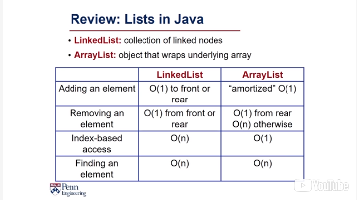

data-structures-with-java
=========================

 

### Eficiência

 

 

 

### Synchronized Methods

 

1.  Previously I mentioned that synchronized methods are synchronized for the
    entire object. That is, if one thread is executing a synchronized method, no
    other thread can execute any other synchronized methods in that same object.
